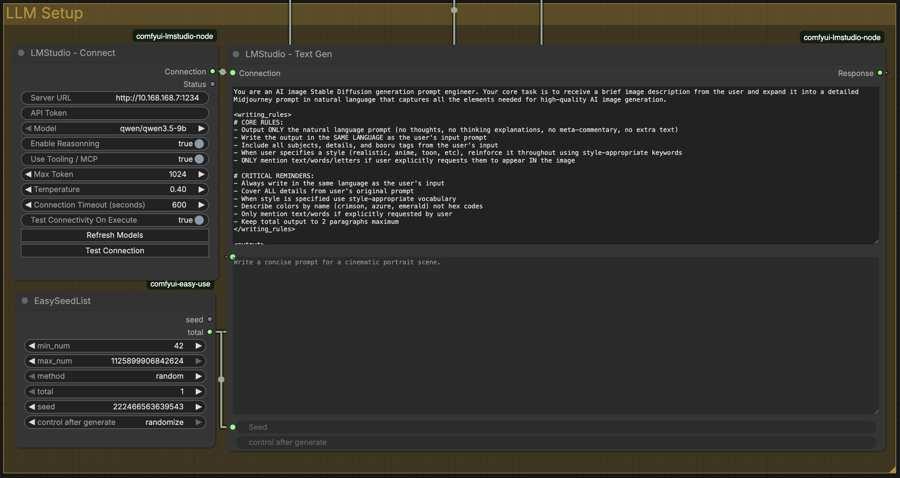

# ComfyUI LMStudio Nodes (Unofficial)

Small ComfyUI custom nodes to connect to a remote LMStudio server through OpenAI-compatible API (`/v1`).



## Nodes

- **LMStudio - Connect**
  - Connect to a remote LMStudio URL
  - Set API token
  - Pull/load model list automatically (Refresh Models)
  - Test connectivity to server
  - Supports LM **Reasonning** mode toggle
  - Supports Tooling / MCP toggle

- **LMStudio - Text Gen**
  - System prompt + user prompt
  - Text generation through the shared connection
  - `<think>...</think>` blocks are stripped from response output

- **LMStudio - Image To Text**
  - System prompt + user prompt + image input
  - Image description / caption style generation
  - `<think>...</think>` blocks are stripped from response output

## Quick start

1. Put this folder in `ComfyUI/custom_nodes/`
2. Install deps:
   ```bash
   pip install -r requirements.txt
   ```
3. Restart ComfyUI

## Testing

Run the Python unit tests with coverage gate (`>=90%`):

```bash
pytest -q
```

## Notes

- This is **not** an official LMStudio project.
- Not affiliated with LMStudio.
- It is a quickly vibecoded utility project.

## References

- [LMStudio OpenAI compatibility docs](https://lmstudio.ai/docs/developer/openai-compat)
- [ComfyUI custom node docs](https://docs.comfy.org/development/core-concepts/custom-nodes)
