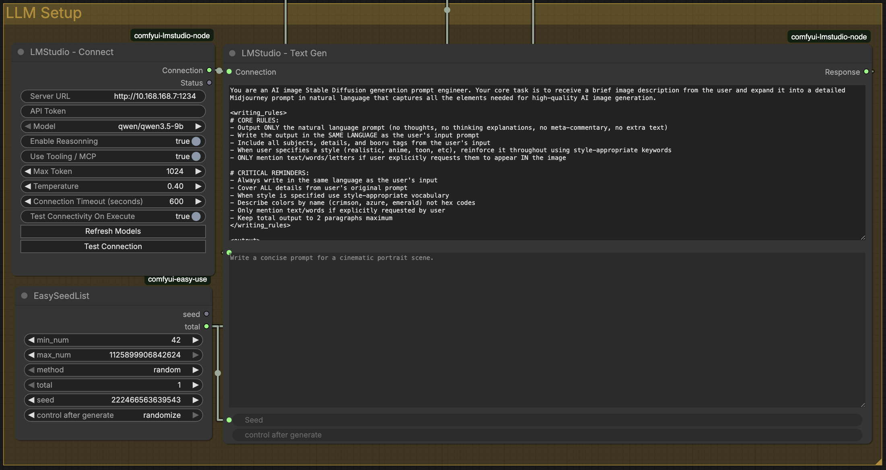

# ComfyUI LMStudio Nodes (Unofficial)

Small ComfyUI custom nodes to connect to a remote LMStudio server through OpenAI-compatible API (`/v1`).



## Nodes

- **LMStudio - Connect**
  - Connect to a remote LMStudio URL
  - Pick the model from a dropdown populated by **Refresh Models**
  - **Test connectivity** to the server
  - **Thinking / Reasoning** control — `auto` / `on` / `off`:
    - `auto` — defer to the model, but force reasoning on for families that stay
      silent by default (Gemma). Qwen3-style models already think by default.
    - `on` — force reasoning on (`enable_thinking: true`).
    - `off` — suppress reasoning so the model answers directly and doesn't burn
      its token budget on a hidden `<think>` trace.
  - Advanced: API token, Tooling / MCP toggle, max tokens, temperature, timeout

- **LMStudio - Text Gen**
  - System prompt + user prompt
  - Text generation through the shared connection
  - `<think>...</think>` blocks are stripped from response output

- **LMStudio - Image To Text**
  - System prompt + user prompt + image input
  - Image description / caption style generation
  - `<think>...</think>` blocks are stripped from response output

## Quick start

1. Put this folder in `ComfyUI/custom_nodes/`
2. Install deps:
   ```bash
   pip install -r requirements.txt
   ```
3. Restart ComfyUI

## Troubleshooting

### macOS: "Connection error" / "No route to host" to a server on your network

LM Studio runs on another machine (say `192.168.1.10`), `curl` from Terminal
reaches it fine, but ComfyUI fails with `Connection error` or
`[Errno 65] No route to host`.

This is **macOS Local Network privacy**. Every app needs permission to talk to
devices on your local network, and the app that launched ComfyUI does not have
it. The nodes detect this case and print the fix, filled in with your own
server address.

**Fix 1: grant the permission.** System Settings → Privacy & Security →
Local Network → switch on the app that runs ComfyUI (Terminal, iTerm,
Comfy Desktop...). Then quit that app fully (⌘Q) and relaunch it.

**Fix 2: the app is not in that list.** Some apps never ask for the
permission, so they never appear there. Comfy Desktop 1.1.3 is one of them. Connections to
your own Mac are always allowed, so run the bundled forwarder in a Terminal
window. It accepts connections on `127.0.0.1` and relays them to your server:

```bash
python3 scripts/lan_forward.py --target 192.168.1.10:1234
```

Leave it running, then set **server_url** on *LMStudio - Connect* to
`http://127.0.0.1:1234`. Use `--listen 11234` if port 1234 is taken on your
Mac (then use `http://127.0.0.1:11234`). On startup the forwarder checks that
it can reach the target, and it tells you if it cannot.

The forwarder only needs the Python that ships with macOS (standard library,
3.9+). It must run from an app that has Local Network permission, such as
Terminal. A `launchd` agent is blocked the same way ComfyUI is. To start it
at login, save this as `lan-forward.command`, make it executable
(`chmod +x lan-forward.command`), and add it under System Settings → General →
Login Items. It opens in Terminal:

```bash
#!/bin/bash
exec python3 "/path/to/comfyUI-LMStudio-nodes/scripts/lan_forward.py" --target 192.168.1.10:1234
```

## Testing

Run the Python unit tests with coverage gate (`>=90%`):

```bash
pytest -q
```

## Notes

- This is **not** an official LMStudio project.
- Not affiliated with LMStudio.
- It is a quickly vibecoded utility project.

## References

- [LMStudio OpenAI compatibility docs](https://lmstudio.ai/docs/developer/openai-compat)
- [ComfyUI custom node docs](https://docs.comfy.org/development/core-concepts/custom-nodes)
